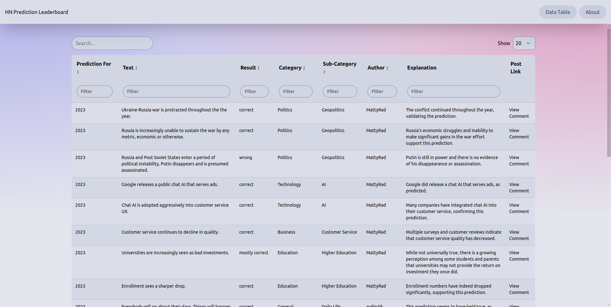

# HN prediction Leaderboard

[Blog post](https://eamag.me/2024/HackerNews-Prediction-Evaluator)

[Website template](https://www.skeleton.dev/docs/ssd)



## Get Started

1. Install [llama.cpp](https://github.com/ggerganov/llama.cpp/tree/master) and start a server

```bash
./llama-server --hf-repo "NousResearch/Hermes-2-Theta-Llama-3-70B-GGUF" \
        -m Hermes-2-Theta-Llama-3-70B-Q3_K_L.gguf \
        -n 16384
```

2. Get HackerNews data [from clickhouse](https://github.com/ClickHouse/ClickHouse/issues/29693#issuecomment-2185388881)
3. Install python packages and run python/dev.ipynb notebook
4. Start a dev website

```bash
pnpm i
pnpm dev
```

5. Deploy to [CloudFlare Pages](https://pages.cloudflare.com/)
